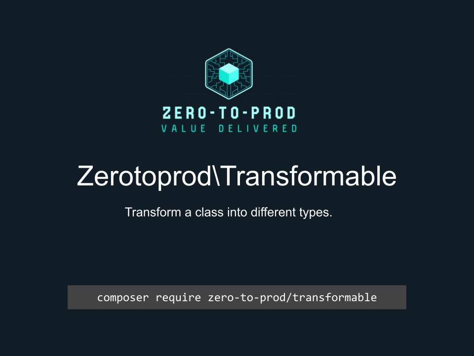

# Zerotoprod\Transformable



[](https://github.com/zero-to-prod/transformable)
[](https://github.com/zero-to-prod/transformable/actions)
[](https://github.com/zero-to-prod/transformable/actions)
[](https://packagist.org/packages/zero-to-prod/transformable/stats)
[](https://packagist.org/packages/zero-to-prod/transformable)
[](https://github.com/zero-to-prod/transformable)
[](https://github.com/zero-to-prod/transformable/blob/main/LICENSE.md)
[](https://wakatime.com/badge/github/zero-to-prod/transformable)
[](https://hitsofcode.com/github/zero-to-prod/transformable/view?branch=main)

## Contents

- [Introduction](#introduction)
- [Requirements](#requirements)
- [Installation](#installation)
    - [Additional Packages](#additional-packages)
- [Usage](#usage)
    - [Methods](#methods)
- [Local Development](./LOCAL_DEVELOPMENT.md)
- [Contributing](#contributing)

## Introduction

Transform a class into different types.

## Requirements

- PHP 7.1 or higher.

## Installation

Install `Zerotoprod\Transformable` via [Composer](https://getcomposer.org/):

```bash
composer require zero-to-prod/transformable
```

This will add the package to your project’s dependencies and create an autoloader entry for it.

### Additional Packages

- [DataModel](https://github.com/zero-to-prod/data-model): Transform data into a class.
- [DataModelHelper](https://github.com/zero-to-prod/data-model-helper): Helpers for a `DataModel`.
- [DataModelFactory](https://github.com/zero-to-prod/data-model-factory): A factory helper to set the value of your `DataModel`.

## Usage

To use the `Zerotoprod\Transformable\Transformable` trait in your class, simply include it:

```php
use Zerotoprod\Transformable\Transformable;

class YourDataModel
{
    use Transformable;

    public $name;
    public $email;
}

$model = new YourDataModel();
$model->name = 'John Doe';
$model->email = 'john.doe@example.com';

$array = $model->toArray();
$json = $model->toJson();
```

### Methods

- `toArray(): array` Converts the object’s properties into an associative array.
- `toJson(): string` Converts the object’s properties into a JSON string.

## Contributing

Contributions, issues, and feature requests are welcome!
Feel free to check the [issues](https://github.com/zero-to-prod/transformable/issues) page if you want to contribute.

1. Fork the repository.
2. Create a new branch (`git checkout -b feature-branch`).
3. Commit changes (`git commit -m 'Add some feature'`).
4. Push to the branch (`git push origin feature-branch`).
5. Create a new Pull Request.
